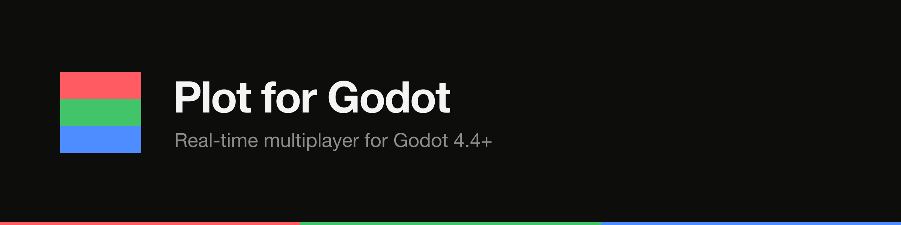

<p align="center"><a href="https://plot.ws"></a></p>

<p align="center">
  <a href="./LICENSE"></a>
  <a href="https://docs.plot.ws/sdks/godot"></a>
  <a href="https://discord.gg/plot"></a>
  
  
</p>

# Plot Godot SDK

GDScript multiplayer SDK for Godot 4.4+.

## Install

Copy `addons/plot/` into your project's `addons/` directory, then enable
the **Plot** plugin in `Project → Project Settings → Plugins`.

## Quickstart

```gdscript
var plot := PlotClient.new({
    "app_key": "pl_pub_live_xxx",
    "player_id": OS.get_unique_id(),
})
add_child(plot)

var room: PlotRoom = await plot.join({ "room_code": "LOBBY1" })
room.message_received.connect(func(from, data):
    print("%s: %s" % [from, data]))
room.player_joined.connect(func(pid): print("joined: ", pid))
room.player_left.connect(func(pid): print("left: ", pid))
room.send({ "hello": "world" })
```

## Interpolation (v1f)

Smoothly render remote state by interpolating between server snapshots:

```gdscript
room.interpolate("players.*.position", "vec2", 100.0)
room.frame_emitted.connect(func(interpolated: Dictionary, ts: float):
    for path in interpolated:
        render_at(path, interpolated[path]))

# Drive the frame loop from _process(delta):
func _process(_delta):
    room.tick_frame()
# ...or start the built-in SceneTreeTimer loop:
room.start_frame_loop(16.0)

# Grow the render delay on jittery connections:
room.set_adaptive_smoothing(true, 1.0, 100.0)
```

Supported types: `"number"`, `"vec2"`, `"vec3"`, `"quat"`; vector/quat values
are `{x, y, z[, w]}` dictionaries. Paths support a single-level `*` wildcard.

### Rewind / point sampling

Sample interpolated state at an arbitrary past server time — the rendering-side
analogue of the server's `ctx.rewindTo` (e.g. client-side hit detection). Pure
read: it never touches the frame loop or correction state.

```gdscript
# at_server_ts is in the server time domain; convert a client time with
# Time.get_unix_time_from_system() * 1000.0 - room.server_clock_offset().
var past: float = now - room.server_clock_offset() - 120.0 # 120ms ago

# One path: returns {x, y} for vec2, or null when `past` is outside the
# buffer's retained horizon.
var p1 = room.sample_at("players.p1.position", "vec2", past)

# Wildcard: a Dictionary keyed by resolved path, or null.
var all = room.sample_at("players.*.position", "vec2", past)

# Bind once, read many paths at the same frozen instant:
var r := room.rewind_to(past)
var shooter = r.sample("players.p1.position", "vec2")
var target = r.sample("players.p2.position", "vec2")
```

## Client-side prediction (v1g)

Apply local inputs immediately and reconcile against the server's
authoritative state. The engine cannot run your server handler, so you supply
a deterministic `Callable(state, input, player) -> state`:

```gdscript
room.attach_prediction(initial_state, func(state, input, player):
    return reduce(state, input, player))

room.predict("players.me.position", "vec2", 100.0)
room.predicted.connect(func(state, ts, drift): render(state))
room.send_predicted({ "move": "left" }) # optimistic; carries _seq upstream

var pos = room.corrected_state["players.me.position"]
print(room.predicted_state)
```

## Protocol

`addons/plot/protocol.gd` is generated from `packages/protocol/codegen/`.
Do not hand-edit. SDK speaks `X-Plot-Protocol: v1b.0`.

## Tests

`tests/test_plot.gd` uses GdUnit4. CI runs Godot 4.4 headless via
`chickensoft-games/setup-godot`.
